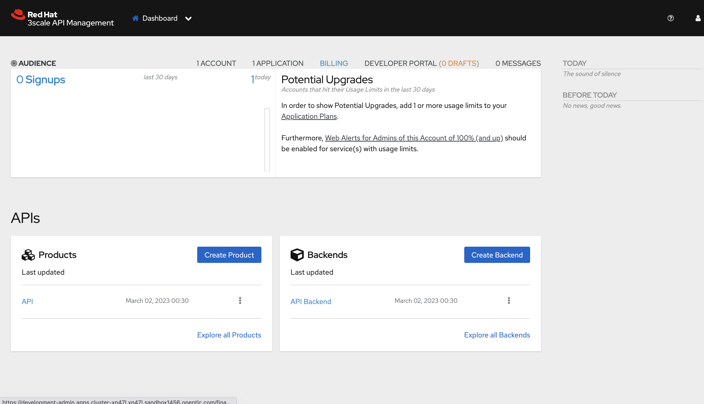
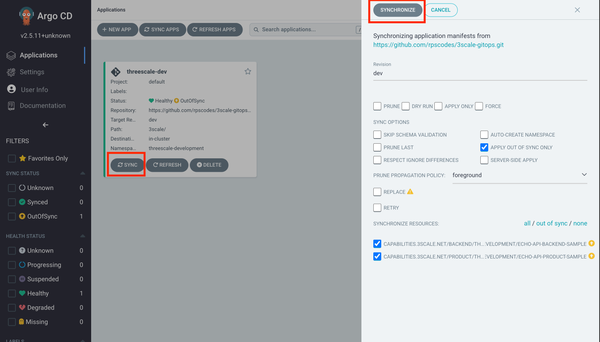
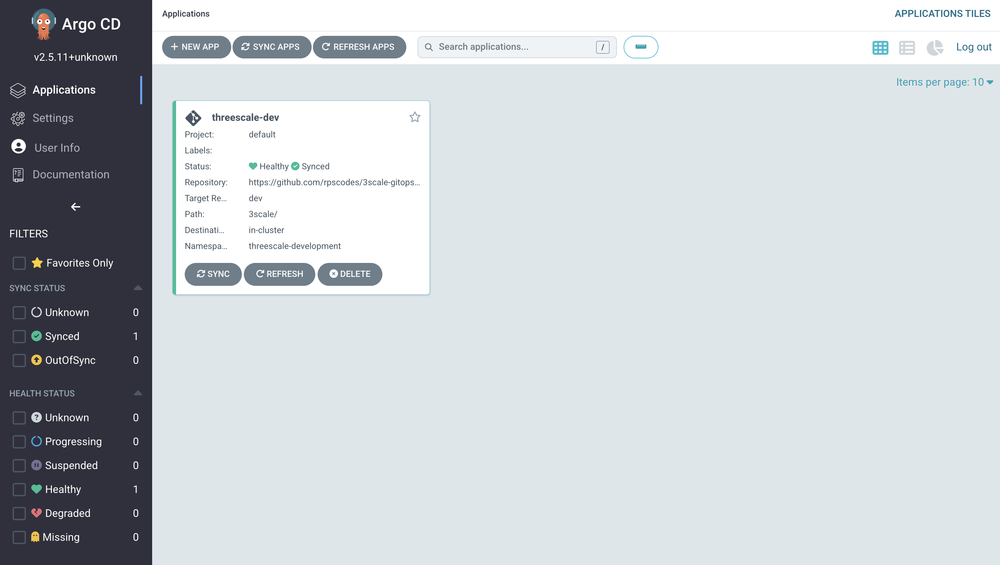
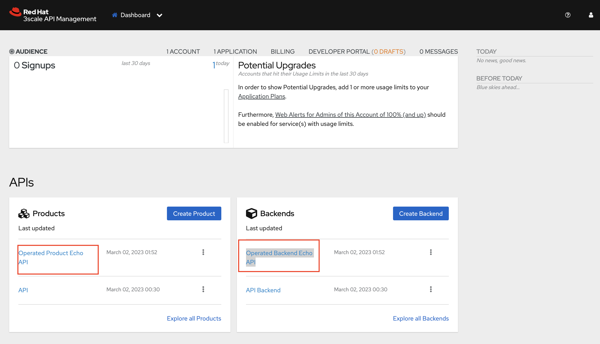
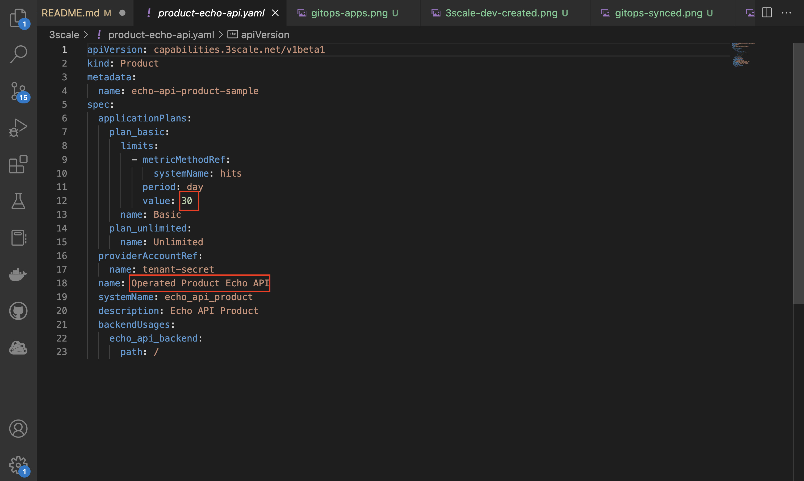
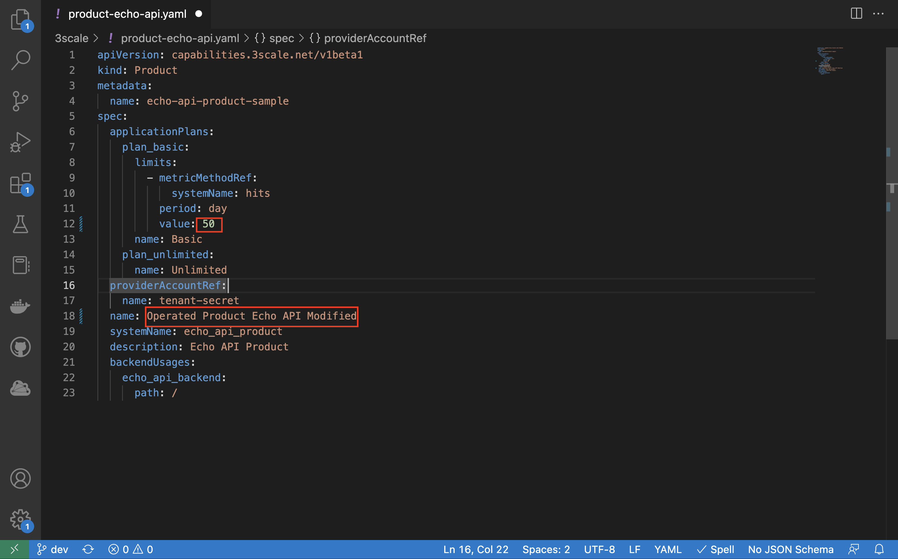
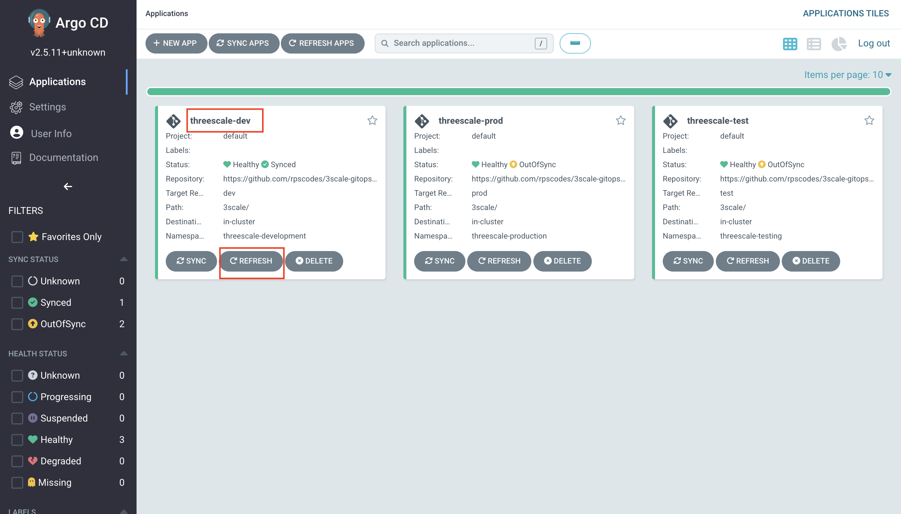
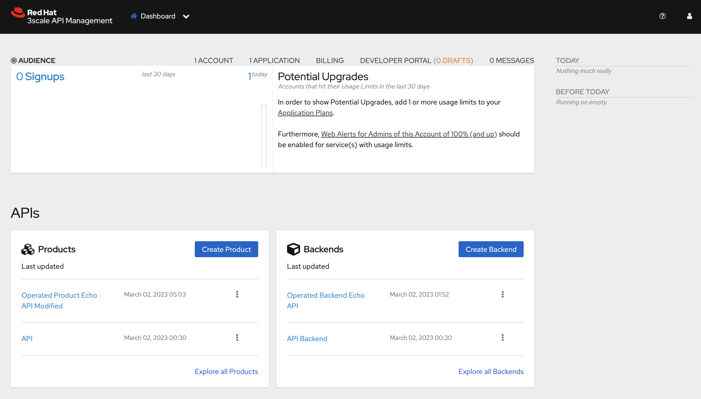
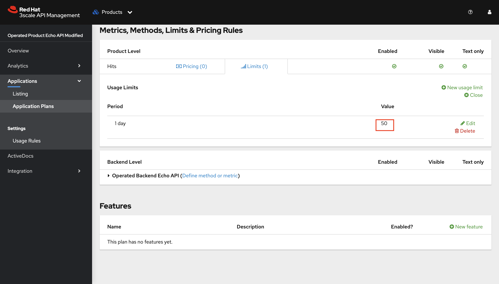
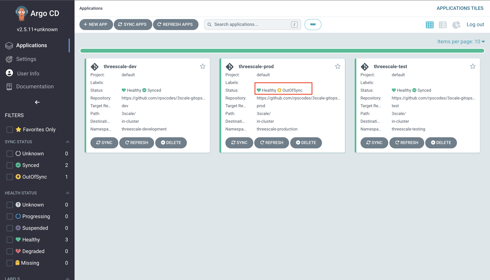

# 3scale Configuration - GitOps Tutorial

The following tutorial provide steps on leveraging GitOps to configure 3scale using 
3scale CRs (Product, Backend CRs etc.)

## Prerequisites
- OpenShift 4.10 and above
- Install 3scale operator from OperatorHub in all namespaces. We do this to set up the different tenants in different namespaces instead of them being in the same namespace as the master installation. 

- Follow the 3scale installation section in this guide to install 3scale using APIManager CR (https://rpscodes.github.io/OpenShift-Service-Mesh-and-3scale-API-Management-Integration/rhs-openshift-starter-guides/4/02-3scale-installation.html?&CLUSTER_WILDCARD_URL=)

- Fork this repository (Make sure you fork all the branches and not just the main branch)

## Install RH OpenShift GitOps
Install Red Hat OpenShift GitOps operator from the OperatorHub in the OCP webconsole


This will automatically create 
- `openshift-gitops` namespace 
- `ArgoCD` CR with the name `openshift-gitops` in openshift-gitops namespace.
 `ArgoCD` CR creates a bunch of deployments. These deployments together make ArgoCD application
- `AppProject` CR with the name `default` in openshift-gitops namespace.

## Login to OpenShift GitOps
Navigate to the `openshift-gitops` namespace and click on the route URL of  `openshift-gitops-server`


You can login to `OpenShift GitOps` using the `admin` user that comes with ArgoCD deployment
 

Find the password for the admin in `openshift-gitops-cluster` secret in `openshift-gitops` namespace.


## Create password secret for tenant creation
Create a secret which has the password that'll be used to login to the tenants. 3scale operator will use this secret to set up the login credentials of the tenants.
```
oc project 3scale
```
```
oc apply -f 3scale/tenants/tenant-password-secret.yaml
```


## Create Tenants in different projects
We will be creating 3 different tenants (development, testing and production) in 3 different projects.
### Development Tenant
Create the development project on your OCP cluster
```
oc apply -f 3scale/namespaces/development-namespace.yaml
```
Edit the tenant CR to replace the placeholder openshift domain url with that of your cluster
```
sed 's/apps.*com/<Replace with your cluster domain URl>/g' 3scale/tenants/tenant-development.yaml > temp.yml && mv temp.yml 3scale/tenants/tenant-development.yaml
```
Example
```
sed 's/apps.*com/apps.cluster-xp47l.xp47l.sandbox1456.opentlc.com/g' 3scale/tenants/tenant-development.yaml > temp.yml && mv temp.yml 3scale/tenants/tenant-development.yaml
```
Create the tenant
```
oc apply -f 3scale/tenants/tenant-development.yaml
```
### Testing Tenant
Create the testing project on your OCP cluster
```
oc apply -f 3scale/namespaces/testing-namespace.yaml
```
Edit the tenant CR to replace the placeholder openshift domain url with that of your cluster
```
sed 's/apps.*com/<Replace with your cluster domain URl>/g' 3scale/tenants/tenant-testing.yaml > temp.yml && mv temp.yml 3scale/tenants/tenant-testing.yaml
```
Example
```
sed 's/apps.*com/apps.cluster-xp47l.xp47l.sandbox1456.opentlc.com/g' 3scale/tenants/tenant-testing.yaml > temp.yml && mv temp.yml 3scale/tenants/tenant-testing.yaml
```
Create the tenant
```
oc apply -f 3scale/tenants/tenant-testing.yaml
```

### Production Tenant
Create the production project on your OCP cluster
```
oc apply -f 3scale/namespaces/production-namespace.yaml
```
Edit the tenant CR to replace the placeholder openshift domain url with that of your cluster
```
sed 's/apps.*com/<Replace with your cluster domain URl>/g' 3scale/tenants/tenant-production.yaml > temp.yml && mv temp.yml 3scale/tenants/tenant-production.yaml
```
Example
```
sed 's/apps.*com/apps.cluster-xp47l.xp47l.sandbox1456.opentlc.com/g' 3scale/tenants/tenant-production.yaml > temp.yml && mv temp.yml 3scale/tenants/tenant-production.yaml
```
Create the tenant
```
oc apply -f 3scale/tenants/tenant-production.yaml
```


## Enabling RBAC
Create cluster role to create, update, delete 3scale CRs (Should have OCP admin access for this)

```
oc apply -f rbac/ClusterRole_gitops-threescale-access.yaml
```
Assign the cluster role to sa `openshift-gitops-argocd-application-controller` in all the projects where the tenants are installed for the gitops application to apply configurations to the different tenants in different projects

```
oc adm policy add-role-to-user gitops-threescale-access system:serviceaccount:openshift-gitops:openshift-gitops-argocd-application-controller -n threescale-development
```
```
oc adm policy add-role-to-user gitops-threescale-access system:serviceaccount:openshift-gitops:openshift-gitops-argocd-application-controller -n threescale-testing
```
```
oc adm policy add-role-to-user gitops-threescale-access system:serviceaccount:openshift-gitops:openshift-gitops-argocd-application-controller -n threescale-production
```

## Connect the git repository

Configure the repositories to be connected by the ArgoCD application 

Click `Manage your repositories, projects, settings` icon on the left panel of the ArgoCD console, Click 
`Repositories` and Click either `Connect repo using SSH` OR `Connect repo using HTTPS` and fill in the form as shown below and click `CONNECT`. Make sure it is SUCCESSFUL.


## Create ArgoCD Application
 
Create the ArgoCD Application for all the three environments/tenants. 

```
oc apply -f gitops/Application_threescale-dev.yaml -n openshift-gitops
```
```
oc apply -f gitops/Application_threescale-test.yaml -n openshift-gitops
```
```
oc apply -f gitops/Application_threescale-prod.yaml -n openshift-gitops
```
Three ArgoCD application `threescale-dev` , `threescale-test` and `threescale-prod`are created.

## 3scale CRs
3scale CRs required for this tutorial are 3scale/backend-echo-api.yaml and 3scale/product-echo-api.yaml

## GitOps in action
Login to the 3scale admin portal of the development tenant with user name `admin`password `openshift`. 


You should only have the default `API`under the products menu. In subsequent steps Argo CD will pick up the configurations from the GitHub repository and apply it to your development environment.



The GitOps application is configured to synch manually. But, it can be changed to synch automatically i.e. changes committed to git repo are automatically applied to 3scale. 
Go to the GitOps console using the route URL it creates as `openshift-gitops-server` in `openshift-gitops` namespace.

Navigate to the `openshift-gitops` namespace and click on the route URL of  `openshift-gitops-server`


You can login to `OpenShift GitOps` using the `admin` user that comes with ArgoCD deployment
 

Find the password for the admin in `openshift-gitops-cluster` secret in `openshift-gitops` namespace.


Click `Manage Application` icon on the left panel of the ArgoCD console. You will then see 3 applications for the three tenants. Let's first work with development tenant which is managed byt the `threescale-dev` application as shown below


Click `SYNC` and `SYNCHRONIZE` as shown below to synch the 3scale CRs 


Once synched then the application should look as below


Go to 3scale Admin console of the development tenant and observe that the product `Operated Product Echo API` and backend `Operated Backend Echo API` are configured as shown below (refresh the browser if you can't see it automatically)


Repeat the `SYNC` and `SYNCHRONIZE` steps for the `threescale-test` and `threescale-prod` applications and the see the changes reflected in the respective tenants. 

### ### GitOps in Action Part 1 - Pushing Changes to the Dev Environment
Now lets try making the changes to the product CR for example let's try to change the name or the rate limits of the product we created in the development environment.

First make sure you've checked out the development branch of the repository
```
git checkout dev
```
Modify the Product name and Rate limits in the product CR using a text editor or vim and save the changes.

- Before


- After


Commit and Push the changes to the dev branch
```
git checkout dev
```
```
git add .
```
```
git commit -m "Change Rate Limits"
``` 

```
git push origin dev
```
Navigate to the Gitops console and refresh the `threescale-dev` app. 


The `threescale-dev` app should be out of sync after the refresh.


`SYNC` and `SYNCHRONIZE` the app. 


The Product Name and Rate Limit Changes should now be reflected  in development tenant




### GitOps in Action Part 2 - Pushing Changes To The Test Environment
Subsequently after development is done we can push the changes from dev to test
```
git checkout test
git merge dev -m "Change Rate Limits"
git push origin test
```

The `threescale-test` app should be out of sync after the `Refresh`.


`SYNC` and `SYNCHRONIZE` the app. The Product Name and Rate Limit Changes should now be reflected  in testing tenant

### GitOps in Action Part 3 - Pushing Changes To The Prod Environment
Finally after your testing is done you can push the changes from test to prod
```
git checkout prod
git merge test -m "Change Rate Limits"
git push origin prod
```

The `threescale-prod` app should be out of sync after the `Refresh`.


`SYNC` and `SYNCHRONIZE` the app. The Product Name and Rate Limit Changes should now be reflected  in production tenant

## Clean Up (Optional)
In order to reuse the repository for future demos and for the instructions to work as expected, we need to clean up all the changes we made to the branches as a part of our above exercise. Run the below commands to revert your changes in the branches

### Dev Clean up
```
git checkout dev
```
```
git revert -m 1 HEAD
```
Add an appropriate message for reverting the commit

```
git push origin dev
```

### Test Clean up
```
git checkout test
```
```
git revert -m 1 HEAD
```
Add an appropriate message for reverting the commit

```
git push origin test
```

### Prod Clean up
```
git checkout prod
```
```
git revert -m 1 HEAD
```
Add an appropriate message for reverting the commit

```
git push origin prod
```